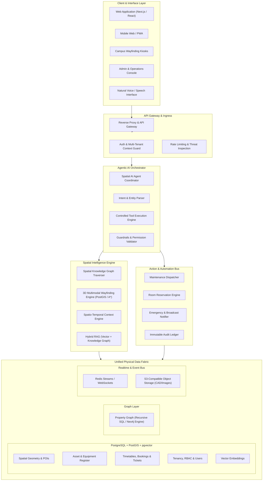
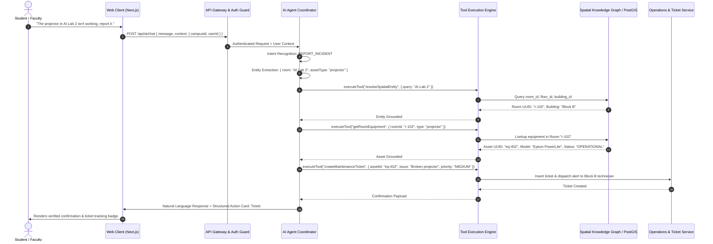
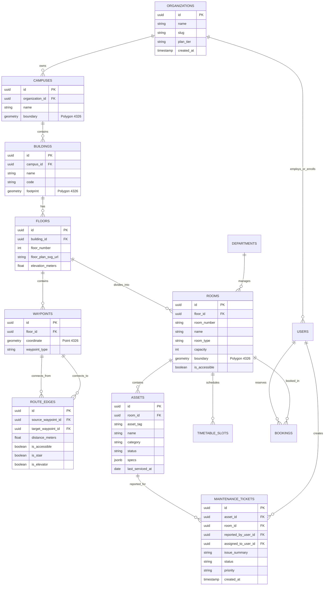
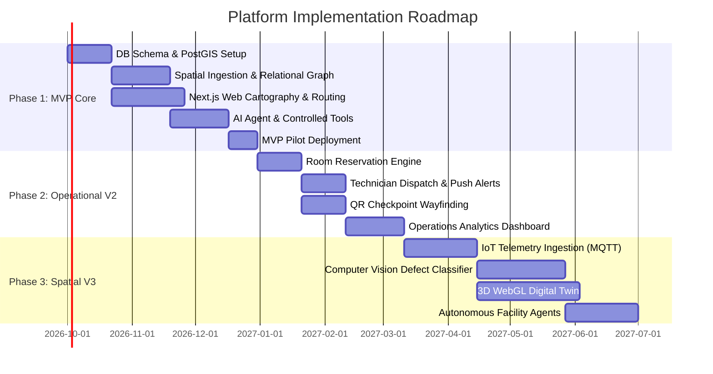

# SPATIAL INTELLIGENCE PLATFORM: ARCHITECTURAL BLUEPRINT & PRODUCT STRUCTURE

> **Vision**: *"AI that understands, navigates, and operates physical spaces."*  
> **Initial Vertical**: University & Higher Education Campuses  
> **Long-Term Trajectory**: Campus → Hospital → Factory → Warehouse → Airport → Corporate HQ → Smart City District  

---

## EXECUTIVE SUMMARY & PRODUCT IDENTITY

This platform is **not** a digital brochure, a static campus map, or a basic timetable viewer. It is an **operating system for physical environments** powered by spatial reasoning, contextual awareness, and autonomous action execution.

Traditional enterprise mapping systems treat spaces as passive 2D/3D geometries. This platform fuses:
1. **Spatial Geometry**: Physical coordinates, bounding polygons, 3D topologies, and navigable graphs.
2. **Semantic Knowledge Graph**: Interconnected relationships between buildings, rooms, equipment, people, schedules, and permissions.
3. **Operational Telemetry & Event Stream**: Live status, bookings, sensor data, and maintenance tickets.
4. **Agentic Action Layer**: Natural language query resolution that translates intent into verified physical actions (booking, dispatching maintenance, rerouting, alerting).

```
┌─────────────────────────────────────────────────────────────────────────────┐
│                             EVOLUTIONARY HORIZON                            │
│                                                                             │
│   ANSWERING   ──►   UNDERSTANDING   ──►   RECOMMENDING   ──►  TAKING ACTION │
│  (Chat & FAQ)      (Spatial Graph)        (Context-Aware)     (Dispatch/Ops)│
└─────────────────────────────────────────────────────────────────────────────┘
```

---

## 1. HIGH-LEVEL SYSTEM ARCHITECTURE



---

## 2. MAIN PRODUCT MODULES

### Module 1: AI Conversational Assistant
- **Purpose**: Conversational interface translating natural human queries into grounded physical queries and verified workflows.
- **Capabilities**:
  - Semantic spatial lookup (*"Where is Room 402?"*, *"Which building houses the Dean's office?"*).
  - Equipment inquiries (*"Does AI Lab 2 have a high-res projector?"*, *"How many systems are operational in Lab 3?"*).
  - Schedule synthesis (*"Where is my next class?"*, *"When does Prof. Sharma hold office hours?"*).
  - Action triggering (*"Create a ticket for projector in Lab 201"*, *"Book Study Room 4 for 3 PM tomorrow"*).
- **Phased Support**: Text & structured interactive cards (MVP) → Voice input/output & Multilingual NLU (V2).

### Module 2: Spatial Intelligence Engine & Knowledge Graph (Core Differentiator)
- **Purpose**: Canonical graph mapping physical topology, containment hierarchies, spatial adjacency, and business entities.
- **Hierarchy Representation**:
  $$\text{Organization} \rightarrow \text{Campus} \rightarrow \text{Zone} \rightarrow \text{Building} \rightarrow \text{Floor} \rightarrow \text{Room/Zone} \rightarrow \text{Asset/Equipment}$$
- **Relational Axioms**:
  - `(:Room)-[:LOCATED_ON]->(:Floor)-[:PART_OF]->(:Building)`
  - `(:Equipment)-[:INSTALLED_IN]->(:Room)`
  - `(:Student)-[:ENROLLED_IN]->(:Class)-[:SCHEDULED_IN]->(:Room)`
  - `(:Room)-[:CONNECTS_VIA {cost, accessibility}]->(:Corridor/Elevator/Stair)`

### Module 3: Digital Campus Map & Visual Cartography
- **Purpose**: Interactive, vector-based 2.5D spatial map rendering buildings, floor footprints, rooms, facilities, and assets.
- **Capabilities**:
  - Interactive multi-level floor switcher (Basement, Ground, Level 1..N).
  - Real-time highlight coordination with AI chat (AI: *"Lab 2 is here"* → map pans & pulses Lab 2).
  - POI filtering (Restrooms, Elevators, Printers, Water stations, Emergency exits).

### Module 4: Indoor & Multimodal Navigation Engine
- **Purpose**: Turn-by-turn indoor and outdoor pathfinding across complex multi-floor structures.
- **Capabilities**:
  - **Shortest Path**: Standard A* algorithm across connected floor graph nodes.
  - **Accessible Routing**: Disables staircase edges, routes strictly via ramps and certified elevators.
  - **Emergency Evacuation**: Dynamic route calculation directing to the nearest unobstructed emergency exit.
  - **Positioning Tech Roadmap**:
    - *V1*: Search-based origin-to-destination & QR checkpoint calibration.
    - *V2*: Wi-Fi RTT/RSSI coarse triangulation & BLE beacon proximity.
    - *V3*: UWB precise positioning and visual inertial odometry (VIO).

### Module 5: Asset & Equipment Intelligence
- **Purpose**: Complete lifecycle digital identity for every hardware, compute, electrical, and facility unit on campus.
- **Entity Attributes**: Unique Asset Tag (UUID/QR), Model, Serial, Type, Location, Status (`OPERATIONAL`, `DEGRADED`, `MAINTENANCE`, `OFFLINE`), Maintenance Logs, Warranty, Assigned Faculty/Department.
- **Asset Categories**: Computing Clusters, Projectors, Smart Boards, Lab Machinery, Network Switches, HVAC Units, Electrical Sub-panels, Emergency Defibrillators/Extinguishers.

### Module 6: Timetable & Room Allocation Engine
- **Purpose**: Spatio-temporal schedule resolution eliminating room booking conflicts and fragmented calendar lookups.
- **Capabilities**:
  - Bidirectional queries: Class → Room, Room → Free Time Slots, Student/Faculty → Next Class.
  - Instant conflict detection and room reservation workflow.

### Module 7: Maintenance & Automated Operations Workflow
- **Purpose**: End-to-end incident reporting, ticket assignment, and operational resolution loop.
- **State Machine**:
  $$\text{REPORTED} \longrightarrow \text{TRIAGED} \longrightarrow \text{ASSIGNED} \longrightarrow \text{IN\_PROGRESS} \longrightarrow \text{RESOLVED} \longrightarrow \text{CLOSED}$$
- **Autonomous Features**:
  - AI extracts room ID, equipment ID, urgency level, and generates ticket without manual form-filling.
  - Auto-notifies assigned technician based on department and floor duty.

### Module 8: Unified Admin & Operations Dashboard
- **Purpose**: Command center for university facility managers, department heads, and campus administration.
- **Live Metrics**: Total buildings/rooms, active assets, equipment health ratio, open tickets by severity, room occupancy rates, wayfinding bottleneck heatmaps.

### Module 9: Data Ingestion & Normalization Engine
- **Purpose**: Low-friction onboarding pipeline to transform legacy campus files into graph entities.
- **Inputs**: CSV/Excel rosters, CAD/DXF floor plans, GeoJSON footprints, campus ERP schedule dumps.
- **Pipeline**: Ingest → Parse → Validate → PostGIS Geometry Transformation → Knowledge Graph Entity Resolution.

---

## 3. USER-ROLE ARCHITECTURE & ACCESS MATRIX

| Capability / Resource | Student | Faculty | Maintenance Staff | Campus Admin | Super Admin |
| :--- | :---: | :---: | :---: | :---: | :---: |
| **Conversational AI Querying** | Read | Read | Read | Full | Full |
| **Campus Navigation & Routing** | Read | Read | Read | Read | Read |
| **View Personal Timetable** | Read (Self) | Read (Self) | - | Read (All) | Read (All) |
| **View Equipment Status** | Read (Basic) | Read (Full) | Read / Update | Full | Full |
| **Reserve / Book Rooms** | - | Create / Cancel | - | Full Override | Full Override |
| **Report Incident / Ticket** | Create | Create | Create | Create | Create |
| **Assign & Resolve Tickets** | - | - | Update (Assigned) | Full Dispatch | Full Dispatch |
| **Manage Spatial Entities (Bldgs/Rooms)**| - | - | - | CRUD | CRUD |
| **Manage Users & RBAC** | - | - | - | Manage Campus | Manage All |
| **Multi-Tenant Org Management** | - | - | - | - | Full Control |
| **Audit Logs & System Analytics** | - | - | - | Read (Campus) | Read (System) |

---

## 4. END-TO-END DATA FLOW & RESOLUTION PIPELINE



---

## 5. AI ARCHITECTURE & TOOL EXECUTION SYSTEM

### 5.1 Architecture Stack
1. **Model**: High-performance LLM via structured JSON tool calling (OpenAI / Claude / Vertex AI).
2. **Deterministic Tool Guard**: The LLM **never** touches databases directly. It can only generate strongly-typed function arguments passed into isolated backend validation services.
3. **Retrieval**:
   - **Vector Store (`pgvector`)**: Campus policies, handbook, syllabus, general FAQs.
   - **Knowledge Graph (SQL/PostGIS)**: Spatial proximity, containment, room schedules, asset topologies.
   - **Hybrid Retrieval**: Combines semantic embeddings with topological filters (e.g., *only assets located in Block B*).

### 5.2 Controlled Tool Registry
```typescript
interface AgentToolDefinitions {
  searchCampus(params: { query: string; campusId: string }): Promise<SearchResult[]>;
  getRoomDetails(params: { roomId: string }): Promise<RoomMetadata>;
  findEquipment(params: { category?: string; roomId?: string; campusId: string }): Promise<Asset[]>;
  getRoomAvailability(params: { roomId: string; date: string; timeSlot?: string }): Promise<Availability>;
  getTimetable(params: { userId: string; role: 'student' | 'faculty'; date: string }): Promise<ScheduleItem[]>;
  calculateRoute(params: { originRoomId: string; destinationRoomId: string; accessibleOnly: boolean }): Promise<NavigationRoute>;
  createMaintenanceTicket(params: { assetId?: string; roomId: string; issueDescription: string; priority: 'LOW' | 'MEDIUM' | 'HIGH' }): Promise<TicketReceipt>;
  bookRoom(params: { roomId: string; startTime: string; endTime: string; purpose: string }): Promise<BookingReceipt>;
  getEmergencyExits(params: { roomId: string }): Promise<EmergencyRoute>;
}
```

---

## 6. SPATIAL KNOWLEDGE GRAPH DESIGN

### 6.1 Ontology & Node Types
- `(:Organization)`: Top-level tenant (e.g., *"National Institute of Technology"*).
- `(:Campus)`: Geographic site (e.g., *"North Campus"*).
- `(:Building)`: Physical structure (e.g., *"Engineering Block B"*).
- `(:Floor)`: Vertical elevation plane (e.g., *"Level 2"*).
- `(:Room)`: Enclosed spatial unit (e.g., *"AI Lab 2"*, *"Auditorium A"*).
- `(:Waypoint)`: Navigable routing node located at doors, intersections, elevators, stairs.
- `(:Asset)`: Physical device (e.g., *"Workstation #23"*, *"HVAC-B2"*).
- `(:Person)`: User identity (Student, Faculty, Staff).
- `(:ClassSession)`: Scheduled academic occurrence.

### 6.2 Edge Taxonomy
```
(:Organization) -[:OWNS]-> (:Campus)
(:Campus)       -[:CONTAINS]-> (:Building)
(:Building)     -[:HAS_FLOOR]-> (:Floor)
(:Floor)        -[:CONTAINS_ROOM]-> (:Room)
(:Room)         -[:HOUSES_ASSET]-> (:Asset)
(:Room)         -[:HAS_ENTRANCE]-> (:Waypoint)
(:Waypoint)     -[:CONNECTS_TO {distance_m, accessible, is_stair, is_elevator}]-> (:Waypoint)
(:ClassSession) -[:OCCURS_IN]-> (:Room)
(:Person)       -[:ATTENDS]-> (:ClassSession)
(:Person)       -[:ASSIGNED_TO_MAINTAIN]-> (:Building)
(:Asset)        -[:UNDER_MAINTENANCE]-> (:Ticket)
```

---

## 7. DATABASE ER DIAGRAM & RELATIONAL SCHEMA



---

## 8. REST & GRAPHQL API ARCHITECTURE

### 8.1 Authentication & Multi-Tenant Ingress
- `POST /api/v1/auth/login` - Authenticate, returns scoped JWT with `org_id`, `campus_id`, `roles`.
- `POST /api/v1/auth/refresh` - Refresh session credentials.
- `GET /api/v1/auth/me` - Retrieve current session context and permission scopes.

### 8.2 Spatial Geometry & Cartography
- `GET /api/v1/campuses` - List all accessible campuses for current tenant.
- `GET /api/v1/campuses/:id/overview` - Bounds, buildings summary, outdoor GeoJSON footprints.
- `GET /api/v1/buildings/:id/floors` - List floors with metadata and SVG/GeoJSON plans.
- `GET /api/v1/floors/:id/rooms` - Room spatial boundaries, labels, occupancy status.

### 8.3 Wayfinding & Navigation
- `POST /api/v1/navigation/route`  
  - *Payload*: `{ originRoomId, destinationRoomId, accessibleOnly: boolean }`  
  - *Response*: `{ path: Waypoint[], totalDistanceMeters, estimatedTimeMinutes, floorTransitions: TransitionStep[] }`
- `GET /api/v1/navigation/emergency-evacuation/:roomId` - Nearest unobstructed emergency exit path.

### 8.4 Asset Register & Hardware Telemetry
- `GET /api/v1/equipment?campusId=&buildingId=&roomId=&status=` - Filterable asset inventory.
- `GET /api/v1/equipment/:id` - Full equipment sheet, maintenance history, connected room details.
- `PATCH /api/v1/equipment/:id/status` - Update operational status (`OPERATIONAL`, `MAINTENANCE`).

### 8.5 Operations, Schedules & Tickets
- `GET /api/v1/timetables/me?date=` - User's personalized schedule and assigned rooms.
- `GET /api/v1/rooms/:id/availability?date=` - Free/busy intervals for specified date.
- `POST /api/v1/bookings` - Create reservation request `{ roomId, startTime, endTime, purpose }`.
- `POST /api/v1/maintenance/tickets` - File maintenance incident `{ roomId, assetId, description, priority }`.
- `GET /api/v1/maintenance/tickets` - Staff ticket queue with status filters.
- `PATCH /api/v1/maintenance/tickets/:id` - Advance ticket status (`ASSIGNED` → `IN_PROGRESS` → `RESOLVED`).

### 8.6 Spatial AI Agent Endpoints
- `POST /api/v1/ai/chat`  
  - *Payload*: `{ message: string, conversationId?: string, clientLocation?: { lat, lng, floorId } }`  
  - *Response*: `{ reply: string, actionsExecuted: ActionSummary[], highlightedEntity?: { type, id } }`
- `POST /api/v1/ai/action-confirm` - Explicit user authorization for high-impact actions.

---

## 9. FRONTEND PAGE & COMPONENT STRUCTURE

```
apps/web/src/
├── app/
│   ├── (auth)/
│   │   ├── login/page.tsx
│   │   └── forgot-password/page.tsx
│   ├── (dashboard)/
│   │   ├── layout.tsx                     # Global App Shell (Sidebar + Global AI Bar)
│   │   ├── page.tsx                       # Unified Student / Faculty Command Center
│   │   ├── map/
│   │   │   └── page.tsx                   # 2.5D Interactive Campus & Floor Cartography
│   │   ├── navigation/
│   │   │   └── page.tsx                   # Turn-by-Turn Indoor/Outdoor Routing
│   │   ├── timetable/
│   │   │   └── page.tsx                   # Class Timetable & Room Schedules
│   │   ├── facilities/
│   │   │   ├── rooms/page.tsx             # Room Directory & Availability Finder
│   │   │   ├── labs/page.tsx              # Specialized Labs & Compute Clusters
│   │   │   └── equipment/page.tsx         # Asset Register & Health Status
│   │   ├── maintenance/
│   │   │   ├── page.tsx                   # Incident Reports & Staff Work Orders
│   │   │   └── report/page.tsx            # Quick Incident Reporting Form
│   │   ├── bookings/
│   │   │   └── page.tsx                   # Room & Lab Reservation System
│   │   └── profile/
│   │       └── page.tsx                   # User Profile & Notification Preferences
│   └── (admin)/
│       ├── layout.tsx                     # Secured Admin Shell
│       ├── admin/
│       │   ├── page.tsx                   # Executive Campus Analytics & Operations
│       │   ├── campus/page.tsx            # Campus & Building Boundary Manager
│       │   ├── rooms/page.tsx             # Room Allocation & Bulk Editor
│       │   ├── equipment/page.tsx         # Asset Lifecycle & QR Tag Generator
│       │   ├── users/page.tsx             # RBAC & Department Permissions
│       │   └── ingestion/page.tsx         # CAD / CSV Batch Data Ingestion Studio
├── components/
│   ├── ai/
│   │   ├── GlobalAIChatBar.tsx            # Persistent Floating AI Input with voice trigger
│   │   ├── AIChatDrawer.tsx               # Expandable Multi-turn Conversation Window
│   │   └── ActionConfirmationModal.tsx    # Verification dialog for actions
│   ├── map/
│   │   ├── CampusMapView.tsx              # MapLibre / Mapbox 2.5D Campus Map Canvas
│   │   ├── FloorLevelSwitcher.tsx         # Vertical floor level selector (B1, G, L1..LN)
│   │   ├── NavigationPathOverlay.tsx      # Polyline path rendering with turn arrows
│   │   └── POIMarkerCluster.tsx           # Categorized interactive map markers
│   ├── common/
│   │   ├── StatusBadge.tsx                # Consistent health & ticket status badges
│   │   └── MetricCard.tsx                 # High-contrast operational KPI tiles
└── stores/
    ├── useAuthStore.ts                    # User session, JWT tokens, active tenant
    ├── useSpatialStore.ts                 # Selected campus, building, active floor, highlighted room
    └── useAIChatStore.ts                  # Chat message history, streaming tokens, action queue
```

---

## 10. BACKEND REPOSITORY ARCHITECTURE

```
apps/api/src/
├── common/
│   ├── decorators/                        # @Roles(), @Tenant(), @CurrentUser()
│   ├── guards/                            # AuthGuard, RolesGuard, TenantIsolationGuard
│   ├── interceptors/                      # AuditLoggingInterceptor, TransformInterceptor
│   └── filters/                           # GlobalExceptionFilter
├── modules/
│   ├── auth/                              # JWT Auth, SSO integration, Token management
│   ├── tenants/                           # Organization & Multi-Campus Isolation
│   ├── spatial/
│   │   ├── campuses.controller.ts
│   │   ├── buildings.controller.ts
│   │   ├── floors.controller.ts
│   │   ├── rooms.controller.ts
│   │   └── spatial.service.ts             # PostGIS operations & spatial boundary queries
│   ├── navigation/
│   │   ├── navigation.controller.ts
│   │   ├── pathfinding.service.ts         # A* Indoor Graph Solver with accessibility filters
│   │   └── waypoint.repository.ts
│   ├── assets/
│   │   ├── assets.controller.ts
│   │   └── assets.service.ts              # Equipment lifecycle, status transitions
│   ├── operations/
│   │   ├── timetable.controller.ts
│   │   ├── bookings.controller.ts
│   │   └── maintenance.controller.ts      # Incident tickets, status machine, technician alerts
│   ├── ai-agent/
│   │   ├── ai.controller.ts               # /chat, /action endpoints
│   │   ├── agent.service.ts               # LLM orchestration, conversation state
│   │   ├── tools/                         # Modular tool executor implementations
│   │   │   ├── search.tool.ts
│   │   │   ├── navigation.tool.ts
│   │   │   ├── booking.tool.ts
│   │   │   └── ticket.tool.ts
│   │   └── rag/
│   │       ├── vector.service.ts          # pgvector similarity searches
│   │       └── graph-rag.service.ts       # Structured spatial context grounding
│   └── ingestion/
│       ├── ingestion.controller.ts
│       ├── parsers/                       # CSV, GeoJSON, DXF geometric parsers
│       └── ingestion.service.ts
└── main.ts
```

---

## 11. MVP ARCHITECTURE (V1 — THE IMMEDIATE BUILD)

The primary goal of the MVP is **proving spatial intelligence value without speculative infrastructure bloat**.

```
┌─────────────────────────────────────────────────────────────────────────────┐
│                             MVP V1 ARCHITECTURE                             │
│                                                                             │
│  [Next.js 14 Web] ──► [NestJS / Express API] ──► [PostgreSQL 16 + PostGIS]  │
│        ▲                       ▲                              │             │
│        │                       │                              ▼             │
│  [2D Interactive Map]    [LLM API + pgvector]    [Relational Spatial Graph] │
└─────────────────────────────────────────────────────────────────────────────┘
```

### V1 Scope Boundaries:
1. **Maps & Cartography**: 2D vector floor maps with interactive room polygons and floor switcher.
2. **Knowledge Graph**: Implemented directly in PostgreSQL using relational adjacency tables and recursive CTE queries (avoids unnecessary dual-database complexity in V1).
3. **Indoor Navigation**: Graph pathfinding across digitized corridor waypoints using Dijkstra / A* with an accessible toggle.
4. **AI Assistant**: Natural language question answering grounded via `pgvector` (campus handbook/rules) + dynamic SQL spatial queries via controlled tools.
5. **Asset & Maintenance Operations**: Searchable equipment catalog with direct "Report Issue" action flow creating trackable maintenance tickets.
6. **Data Storage**: Single consolidated PostgreSQL instance with `postgis` and `pgvector` extensions.

---

## 12. V2 ARCHITECTURE (OPERATIONAL EXPANSION)

- **Live Room Availability**: Real-time room vacancy queries powered by calendar ERP sync and manual kiosk check-ins.
- **Physical QR Calibration**: Doorframe QR codes for instantaneous user location calibration (*"You are at Block B, Floor 2, outside Room 204"*).
- **Multi-Role Push Notification Bus**: WebSocket & Firebase Cloud Messaging (FCM) alerts dispatched to technicians when tickets are created in their zone.
- **Dedicated Graph Analytics Engine**: Offloading heavy graph traversals to Neo4j / AWS Neptune once cross-campus relational query volume warrants dedicated infrastructure.
- **Automated Ingestion Studio**: Visual admin tool to upload campus GeoJSON / CAD floor layers with assisted entity mapping.

---

## 13. V3 ARCHITECTURE (AUTONOMOUS PHYSICAL INTELLIGENCE)

- **IoT & Sensor Mesh**: Real-time telemetry ingestion (PIR occupancy sensors, energy meters, smart locks) via MQTT and Kafka.
- **Computer Vision Defect Logging**: Multimodal vision pipeline allowing students to snap a photo of damaged equipment; AI recognizes asset tag, classifies damage type, and files pre-populated ticket.
- **Real-Time 3D Digital Twin**: Three.js / WebGL / Unreal Engine Web Pixel Streaming for immersive virtual campus exploration and situational control rooms.
- **Predictive Maintenance Agents**: Automated spatial agents that correlate room usage frequency with HVAC wear-and-tear to schedule preventive servicing before hardware fails.
- **Dynamic Emergency Evacuation**: Integrates fire alarm trigger inputs to automatically flag compromised corridors and recalculate safe egress paths in real-time.

---

## 14. SECURITY & GOVERNANCE ARCHITECTURE

```
┌─────────────────────────────────────────────────────────────────────────────┐
│                         MULTI-LAYERED DEFENSE IN DEPTH                      │
│                                                                             │
│   [Strict Tenant Isolation] ──► [Granular RBAC] ──► [Prompt Injection Shield]│
│               │                         │                        │          │
│               ▼                         ▼                        ▼          │
│      (Row-Level Security)      (Field Permissions)     (Deterministic Tools)│
└─────────────────────────────────────────────────────────────────────────────┘
```

1. **Multi-Tenant Data Isolation**: 
   - Every database table carries an indexed `organization_id` foreign key.
   - PostgreSQL **Row-Level Security (RLS)** is enforced at the connection pool layer, ensuring a query can never accidentally leak cross-tenant spatial data.
2. **Prompt Injection & AI Sandboxing**:
   - The LLM has zero direct SQL execution rights.
   - All tool invocations are strictly schema-validated via Zod before hitting backend controllers.
   - System prompts employ delimiter encapsulation and output verification.
3. **Audit Ledger**:
   - Every state-altering action (ticket status update, room booking, door access request) produces an append-only event record in `audit_logs` storing `user_id`, `ip_address`, `action_type`, `old_state`, and `new_state`.
4. **Data Protection**:
   - AES-256 encryption at rest for all database volumes and object storage buckets.
   - TLS 1.3 enforced for all external and intra-service communication.

---

## 15. MULTI-TENANT SAAS ARCHITECTURE

The platform is engineered as a horizontal enterprise B2B SaaS solution serving diverse university networks and institutional campuses.

```
PLATFORM ROOT
 ├── Tenant: "Greenwood University" (org_8f91a)
 │    ├── Campus: "Downtown Campus"
 │    └── Campus: "Medical Research Complex"
 └── Tenant: "Imperial Institute of Tech" (org_4b22c)
      └── Campus: "Main Campus"
```

- **Domain Routing**: Supports vanity subdomains (e.g., `greenwood.campusai.com`) and custom enterprise domains (`campus.greenwood.edu`).
- **Data Model Strategy**: Shared database with tenant-discriminator columns and automated RLS policies (optimal balance of operational simplicity, cost-efficiency, and bulletproof tenant isolation for 1–500 campus deployments).

---

## 16. CROSS-VERTICAL FUTURE EXPANSION ARCHITECTURE

The foundational ontology is domain-agnostic. While campuses represent the first wedge market, the schema maps 1-to-1 to major commercial environments:

| Campus Vertical (V1) | Hospital Vertical | Airport Vertical | Factory / Warehouse |
| :--- | :--- | :--- | :--- |
| **Campus** | Medical Center Campus | Airport Terminal Complex | Manufacturing Plant |
| **Building** | Surgical Wing | Concourse B | Assembly Hall 4 |
| **Floor** | Floor 3 (ICU) | Departures Level | Mezzanine 2 |
| **Room** | Operating Theatre 2 | Gate 14 / Lounge | Staging Bay 7 |
| **Asset** | Ventilator / MRI | Baggage Carousel / X-Ray | Robotic Arm / Conveyor |
| **User** | Doctor / Nurse / Patient | Passenger / Ground Crew | Plant Engineer / Operator |
| **Timetable** | Shift / Surgery Schedule | Flight Departure Schedule | Production Shift Schedule |
| **Action** | Equipment sterilization | Gate reassignment alert | Machine downtime ticket |

---

## 17. COMPLETE FEATURE HIERARCHY

```
Spatial Intelligence Platform
├── 1. Core Spatial Services
│   ├── 1.1 Campus Cartography & Rendering (2D & 2.5D)
│   ├── 1.2 Multi-Floor Vertical Navigation
│   ├── 1.3 Accessible & Barrier-Free Pathfinding
│   ├── 1.4 Emergency Evacuation Guidance
│   └── 1.5 POI Discovery & Spatial Search
├── 2. Conversational Intelligence Services
│   ├── 2.1 Natural Language Campus Query Resolution
│   ├── 2.2 Grounded Contextual Q&A (Handbook & Rules)
│   ├── 2.3 Multilingual & Voice NLU (V2)
│   └── 2.4 Proactive Location-Based Recommendations
├── 3. Facility & Operational Services
│   ├── 3.1 Digital Asset & Equipment Registry
│   ├── 3.2 Spatio-Temporal Timetable & Class Finder
│   ├── 3.3 Conflict-Free Room Booking Engine
│   └── 3.4 Automated Maintenance Incident Dispatch
├── 4. Ingestion & Spatial Modeling
│   ├── 4.1 CAD / DXF Floor Plan Geometry Ingestion
│   ├── 4.2 GeoJSON Campus Boundary Importer
│   └── 4.3 ERP Timetable & Class Roster Sync
└── 5. Administration & Governance
    ├── 5.1 Multi-Tenant Organization Management
    ├── 5.2 Role-Based Access Control (RBAC)
    ├── 5.3 Space Utilization & Incident Analytics
    └── 5.4 Comprehensive Audit Trail
```

---

## 18. DEVELOPMENT ROADMAP & EXECUTION TIMELINE



### Strategic Milestones:
- **Milestone 1 (End of Month 2)**: Core spatial foundation, interactive 2D map, room search, and conversational AI answering schedule/location queries.
- **Milestone 2 (End of Month 4)**: Turn-by-turn routing with elevator/stair accessibility toggles and end-to-end maintenance ticketing loop live in pilot campus.
- **Milestone 3 (End of Month 7)**: Multi-tenant SaaS self-serve onboarding, automated CAD floor plan conversion, and live facility utilization dashboard.
- **Milestone 4 (End of Month 12)**: IoT occupancy stream integration, computer vision incident reporting, and cross-vertical expansion into healthcare/enterprise sites.

---

*Architectural Blueprint Certified for Production Scaffold Implementation.*
