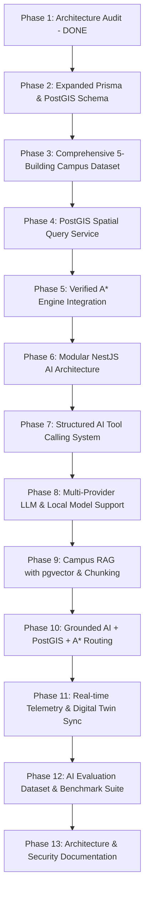

# SPATIAL INTELLIGENCE PLATFORM: COMPREHENSIVE ARCHITECTURAL AUDIT

> **Document Version**: 2.0.0  
> **Audit Date**: September 24, 2026  
> **Auditors**: Senior AI Systems Architect, Geospatial Engineer, Full-Stack Engineer  
> **Repository Root**: `c:\Users\User\Desktop\campusAI`  

---

## 1. EXECUTIVE SUMMARY

The **Spatial Intelligence Platform** is an enterprise-grade cyber-physical operating system and digital twin for campus environments. It bridges physical space cartography, indoor multimodal wayfinding, facilities operations, and artificial intelligence into a unified command and interaction layer ("*The Campus is the Interface*").

This audit evaluates the current implementation against the target specification for an **AI-powered Campus Intelligence Platform / Digital Twin** combining LLM orchestration, Campus RAG, PostgreSQL + PostGIS, pgvector, A* pathfinding, real-time spatial reasoning, and digital twin visualization.

---

## 2. CURRENT REPOSITORY ARCHITECTURE

The repository is structured as an npm workspaces monorepo:

```
campusAI/
├── apps/
│   ├── api/                 # NestJS 10 Backend Application (Port 4000)
│   │   ├── src/
│   │   │   ├── common/data/ # SpatialDataService (in-memory repository fallback)
│   │   │   ├── modules/
│   │   │   │   ├── ai-agent/# AIAgentController, AgentService, ToolExecutorService
│   │   │   │   ├── operations/# MaintenanceController
│   │   │   │   └── spatial/ # SpatialController (campuses, buildings, floors, rooms, routes)
│   │   │   ├── app.module.ts
│   │   │   ├── main.ts
│   │   │   └── acceptance.test.ts
│   │   └── tsconfig.json
│   └── web/                 # Next.js 14 Web Application (Port 3000)
│       ├── src/
│       │   ├── app/         # page.tsx, layout.tsx (Campus OS Assembly)
│       │   ├── components/
│       │   │   ├── ai/      # GlobalAIChatBar, AIChatDrawer
│       │   │   ├── demo/    # PresentationDemoRunner (12-step tour)
│       │   │   ├── inspector/# ContextInspector (Room, Building, Safety telemetry)
│       │   │   ├── intelligence/# KnowledgeGraphModal, CampusAnalyticsView
│       │   │   ├── layout/  # TopHeaderBar, MissionControlSidebar
│       │   │   ├── maintenance/# MaintenanceReportModal
│       │   │   ├── map/     # CampusMapView (2.5D Digital Twin, GIS Layers)
│       │   │   └── safety/  # SafetyEmergencyHUD
│       │   ├── services/    # campusData.service.ts
│       │   └── stores/      # useSpatialStore.ts, useAIChatStore.ts
│       └── package.json
├── packages/
│   ├── database/            # Prisma Schema, Seed Engine, PostGIS Init
│   │   ├── prisma/schema.prisma
│   │   ├── init.sql         # PostGIS, uuid-ossp, pgvector extension initialization
│   │   └── src/seed-data.ts, seed.ts
│   ├── spatial-graph/       # Multimodal A* Routing Engine & Spatial Ontology
│   │   ├── src/a-star-router.ts
│   │   ├── src/ontology.ts
│   │   └── src/router.test.ts
│   └── types/               # Shared TypeScript Contracts
│       └── src/spatial.ts, assets.ts, operations.ts, ai.ts
├── docker-compose.yml       # PostGIS 16-3.4 + Redis 7 alpine
└── docs/                    # Architectural Specifications & Audits
```

---

## 3. AUDIT OF EXISTING FEATURES

### A. Working & Verified Features ✅
1. **Multimodal A* Routing Engine (`@spatial/spatial-graph`)**:
   - Euclidean spatial heuristic with latitude/longitude projection scaling.
   - Cost-weighted traversal respecting accessibility constraints (ADA wheelchair routing excludes stair edges).
   - Dynamic floor transition detection (identifying transitions via `ELEVATOR` vs `STAIRS`).
   - Avoidance of blocked waypoints.
   - 100% test pass rate in automated unit tests (`router.test.ts`).
2. **Backend API Endpoints (`apps/api`)**:
   - `GET /api/v1/spatial/campuses`, `GET /campuses/:id/buildings`, `GET /buildings/:id/floors`, `GET /floors/:id/rooms`.
   - `GET /api/v1/spatial/navigation/route` with origin, destination, and accessibility parameters.
   - `GET /api/v1/maintenance/tickets` and `PATCH /tickets/:id/status`.
   - `POST /api/v1/ai/chat` and `POST /api/v1/ai/tool`.
   - Role-Based Access Control (RBAC) enforced on privileged tool execution (`updateTicketStatus` requires `MAINTENANCE_STAFF` or `ADMIN`).
3. **Frontend Digital Twin Cartography (`apps/web`)**:
   - Next.js 14 client-rendered 2.5D isometric spatial map with SVG geometry.
   - Dual-mode zoom: **Macro Campus View** (campus grounds, road arteries, central lawn, buildings, parking) and **Building Interior Floorplans** (Level 1 Ground, Level 2 AI Labs, Level 3 Research).
   - Dynamic GIS Spatial Layers (Buildings, Rooms, Navigation path, People Density, WiFi 6, CCTV, Energy, Air Quality, Equipment, Accessibility, Fire Safety, Parking).
   - Animated SVG gradient stroke pathfinding route between waypoints.
   - Context-aware right inspector panel (live occupancy gauges, environmental sensors: 22.8°C temp, 560 ppm CO2, humidity, class timetable, equipment health).
   - Omnipresent floating Campus AI Copilot bar with prompt suggestion pills.
   - Emergency Safety HUD with instant evacuation vectors to Green Zone A muster lawn.
   - Interactive SVG Knowledge Graph (`Student → Class → Faculty → Room → Building → Equipment → Department`).
   - Campus Analytics Console with hourly room utilization curves and facility energy intensity.
   - 1-Click Presentation Demo Mode with 12 automated scripted walkthrough steps.

---

### B. Broken, Simulated, or Mock Features ⚠️
1. **Database Runtime Decoupling**:
   - `SpatialDataService` in `apps/api` loads mock data from `SEED_DATA` in memory rather than querying PostgreSQL/PostGIS.
   - If PostgreSQL is down, the API still runs on in-memory seed data, but real persistence and PostGIS spatial SQL queries are not executed against the database.
2. **AI Intent Classification & Reasoning**:
   - `AgentService.ts` currently uses regular expression matching (`routeMatch`, `roomLookup`, keyword branches) rather than a real LLM Orchestrator with structured function calling.
   - No LLM provider abstraction exists (OpenAI, Anthropic, Google Gemini, Ollama/Local LLM).
   - The AI cannot answer queries outside the hard-coded regex cases or reason over un-templated combinations.
3. **Zero RAG Pipeline**:
   - No document ingestion pipeline (PDF, DOCX, TXT, Markdown, CSV).
   - No chunking, text splitting, or embedding generation service.
   - No semantic vector retrieval via pgvector.
   - The AI cannot cite campus manuals, policies, emergency guidelines, or faculty directories.
4. **Mocked Telemetry**:
   - Sensor readings (temperature, humidity, CO2 ppm, energy kW, WiFi signal) are currently static numbers in `campusData.service.ts` rather than coming from an abstracted `realtime/` provider architecture.
5. **Small Demo Dataset**:
   - Database seed data currently contains only 1 campus, 2 buildings, 3 floors, 5 rooms, 8 waypoints, and 4 equipment items. Section 27 requires a full campus with 5 buildings, 3-4 floors each, 20+ rooms, 5+ labs, library, cafeteria, auditorium, administration, parking, and medical center.

---

## 4. DATABASE & POSTGIS GAPS

| Dimension | Current State | Target Requirement | Gap |
| :--- | :--- | :--- | :--- |
| **Geometry Columns** | Float `latitude`, `longitude` | Native PostGIS `geometry(Point, 4326)`, `geometry(Polygon, 4326)`, `geometry(LineString, 4326)` | High: Prisma schema uses scalar Floats; spatial SQL operations cannot be indexed natively with GIST. |
| **Vector Storage** | `init.sql` enables `vector` extension | `documents` and `document_chunks` tables with `vector(1536)` embeddings | High: Tables do not exist in `schema.prisma`. |
| **Entity Richness** | 11 models | 22 models including `Facility`, `Sensor`, `SensorReading`, `EmergencyPoint`, `Announcement`, `AIConversation`, `AIMessage` | High: Missing physical facility and IoT sensor entities. |
| **Spatial Functions** | JavaScript math in memory | `ST_DWithin`, `ST_Distance`, `ST_Contains`, `ST_Intersects`, `ST_Centroid` | High: All distance and spatial filtering is performed in Node.js rather than offloaded to PostGIS. |

---

## 5. AI & ORCHESTRATION GAPS

1. **Lack of Dedicated AI Orchestrator Module**:
   - Target structure requires `backend/src/ai/` with:
     - `orchestrator/`: intent classification, tool router
     - `rag/`: document extraction, chunking, embedding, retrieval
     - `tools/`: structured tool definitions (`searchRooms`, `findNearestRoom`, `checkRoomAvailability`, `calculateRoute`, etc.)
     - `spatial/`: PostGIS spatial service, route integration
     - `realtime/`: live sensor & occupancy provider
2. **Provider Agnostic LLM Interface**:
   - Missing an abstract `LLMProvider` interface with cloud (OpenAI, Gemini, Anthropic) and local (Ollama) implementations.
3. **Structured Tool Calling**:
   - The LLM must not directly execute SQL. It must output structured tool calls, which the orchestrator validates, runs against domain services, and injects back as grounded tool results.
4. **Grounding & Citations**:
   - Responses must include source provenance (`database`, `rag_document`, `realtime_sensor`) and refuse to hallucinate unverified room numbers or locations.

---

## 6. SECURITY & OBSERVABILITY AUDIT

1. **Authentication & RBAC**:
   - `User` entity has `passwordHash` and `role`, but API endpoints currently lack an active JWT guard.
   - The `x-user-role` header is passed in plaintext without cryptographic signature verification.
2. **Prompt Injection & Input Validation**:
   - Inputs are passed directly to regex matchers. With an LLM, prompt sanitization, maximum token bounds, and strict tool output schemas are mandatory.
3. **Observability**:
   - No telemetry logger tracking AI latency, tool execution time, retrieval precision, token usage, or failed query analytics.

---

## 7. RECOMMENDED IMPLEMENTATION ORDER

Following Section 30 of the Master Prompt:


